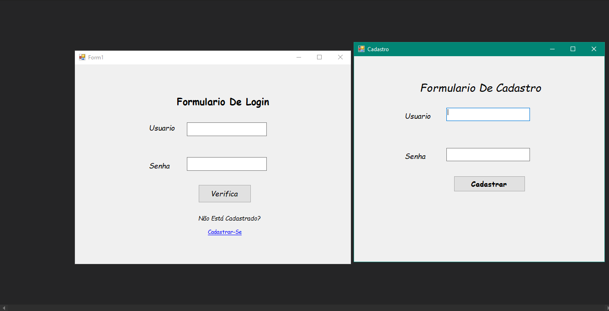

# Formulario De Login-Cadastro C#
Formulario De cadastro de Usuarios E Login De
Usuarios Verificando No BD

## Tecnologias
- MySql WorkBench
- C#
- Windows Form
- Editor:Visual Studio

## Objetivo:

Cadastrar Ou Verificar se o usuario está Cadastrado
no banco De Dados

Obs: Quando Cadastrar O usuario Reinicie o programa
para ele gravar no Banco De Dados 

## Screenshots

